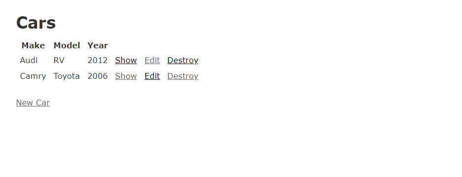

[![Issues][issues-shield]][issues-url]
[![MIT License][license-shield]][license-url]

# First Rails App

 

  <h3 align="center">
	First rails App
  </h3>
    <h3 align="center">
    Live Version on Heroku - https://fathomless-thicket-19768.herokuapp.com/cars
    </h3>
    

    A car generator app for geerating different models of cars directly from the browser with a text editor.This is basically my first rails app.
It allows users to create, update, and delete info from a database.
So here one can create different models of cars 
You will also have to ability to delete items you added to the databse.
All happening instantaneously on the browser.
     
    <a href="https://github.com/mikenath223/my_first_rails_app/blob/master/README.md"><strong>Explore the docs 📜</strong></a>
     
     
	  ✒
    <a href="https://www.theodinproject.com/courses/web-development-101/lessons/your-first-rails-application">Assigment</a>
    🕳
    <a href="https://github.com/mikenath223/my_first_rails_app/issues">Report Bug</a>
    🙏
    <a href="https://github.com/mikenath223/my_first_rails_app/issues">Request Feature</a>
  

## Built With

* Passion for coding 💜

* Ruby version
  Version:  2.6.4

* Rails version
  Version: 5.2.3

* Linux OS

## Screenshot

# Get Started
 This section constains instructions on how to get the project set up and running on your local machine and also  deploy on heroku and build on docker.
 
 ## Prerequisites
  - This project requires <a href="https://www.ruby-lang.org/en/documentation/installation/">Ruby</a> and <a href="http://installrails.com/">Rails</a> to be installed.
- After installation run `ruby v` to ensure ruby installed correctly.
- Next run `rails v` to check that rails installed correctly too.

### Installing
 Run `bundle install` to install the needed project dependencies.
 
 ### Serve Project
  Start the rails server with the command `rails s`. Then head over to your local browser and go to this link: `localhost:3000`
 
 ## Deploy on Heroku
 You can deploy the project on heroku by following these steps:
 1. Create a new account on <a href="https://www.heroku.com/">Heroku</a>.
 2. Run `heroku create` on your terminal to create a new heroku app.
 3. Run `heroku push` to start a deploment to heroku, get a coffee☕ and wait for it to deploy.
 4. Run `heroku migrate` to run migrations on your production database.
 5. Next head over to your app url provided by Heroku and access your My First Rails app🎉.
 
# Author
Ukeje Michgolden
* [LinkedIn](https://ng.linkedin.com/in/michgolden-ukeje-73b01614b)
* [Twitter](https://twitter.com/Michgolden_Nath)

# Contributing
1. [Fork it] (https://github.com/mikenath223/my-first-rails-app/fork).
2. Create your feature branch (git checkout -b feature/fooBar).
3. Commit your changes (git commit -am 'Add some fooBar').
4. Push to the branch (git push origin feature/fooBar).
5. Create a new Pull Request.

## Acknowledgements
* [Microverse](https://www.microverse.org/)
* [The Odin Project](https://www.theodinproject.com/)

<!-- MARKDOWN LINKS & IMAGES -->
<!-- https://www.markdownguide.org/basic-syntax/#reference-style-links -->
[issues-shield]: https://img.shields.io/github/issues/mikenath223/my_first_rails_app
[issues-url]: https://github.com/mikenath223/my_first_rails_app/issues
[license-shield]: https://img.shields.io/github/license/mikenath223/my_first_rails_app
[license-url]: https://github.com/mikenath223/my_first_rails_app/blob/master/LICENSE.txt
